## HTML 5 e CSS 3

Vamos utilizar HTML e CSS e criar layouts para uma página web estática.

#### GitHub Pages:
**Acessem:**
[Barbearia Alura](https://tiagomerc.github.io/HTML-5-e-CSS3/index.html)

### Curso de HTML5 e CSS3 parte 1: a primeira página da Web

#### Faça esse curso de HTML e CSS e:

- Aprenda o que é o HTML e o CSS

- Entenda a estrutura básica de um arquivo HTML

- Utilize o navegador para inspecionar elementos

- Aprenda a definir estilos para elementos usando o CSS

### Prints:

#### Organização da página e estilização inicial
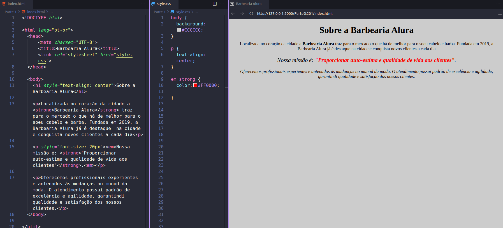

#### Finalizando a página

23/05/2022

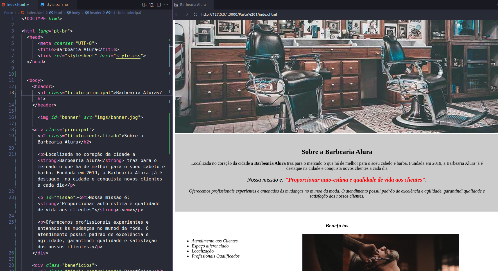

#### Página produtos

24/05/2022 

1 - Criando uma nova página

2 - Navegação entre páginas

3 - Posicionamento dos elementos

**O que aprendemos?**

Nesta aula, aprendemos:

- Como remover os estilos que o navegador cria automaticamente

- Como funciona os posicionamentos static, relative e absolute dos elementos

- Como posicionar o cabeçalho da nossa página

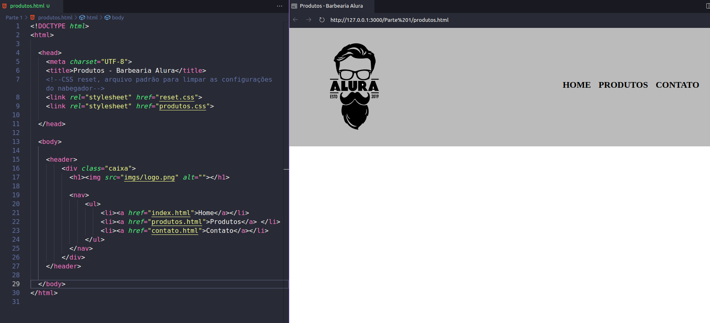

25/05/2022 | A tag section

**O que aprendemos?**

Nesta aula, aprendemos:

- A tag main, para o conteúdo principal da nossa página

- A criar listas complexas, com títulos, imagens e parágrafos

- A utilizar o inline-block

- A praticar e estilizar o conteúdo principal da nossa página

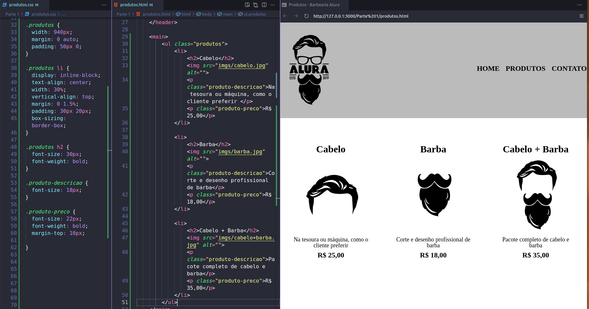

26/05/2022 | Lidando com bordas

**O que aprendemos?**

###### Lidando com bordas

Nesta aula, aprendemos:

- Através do CSS, aplicar bordas nos elementos.

- Os diferentes tipos de bordas.

- A deixar a borda arredondada.

###### Pseudo-classes CSS

Nesta aula, aprendemos:

Algumas pseudo-classes CSS
 - hover, quando o usuário passa o cursor sobre o elemento

 - active, quando um elemento está sendo ativado pelo usuário

- A mudar a cor do texto e/ou da borda de um elemento, quando o usuário passar o cursor sobre o mesmo

- A mudar a cor da borda de um elemento, quando o mesmo estiver sendo ativado pelo usuário

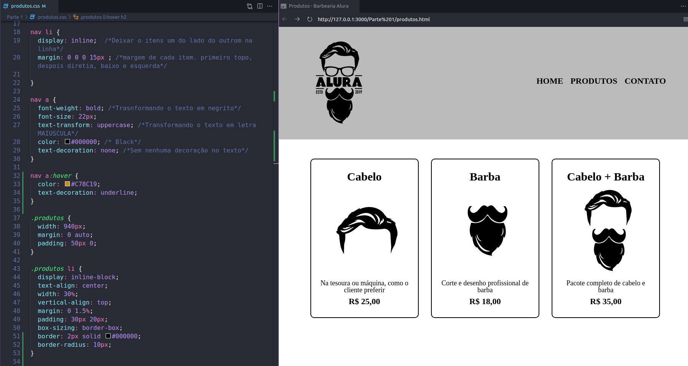

##### Finalizando a página de produtos 

Nesta aula, aprendemos:

- A tag footer, para o rodapé da nossa página

- Que, com CSS, podemos colocar uma imagem de fundo em um elemento

  - Quando colocamos uma imagem de fundo em um elemento, o CSS, por padrão, copia e cola a imagem diversas vezes até ocupar todo o espaço do elemento

  - A tabela Unicode 

  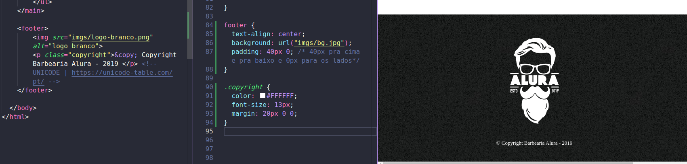

_______________

### HTML5 e CSS3 parte 3: trabalhando com formulários e tabelas

31/05/2022 | Criando uma nova página e começando um formulário

**O que aprendemos?**

Nesta aula, aprendemos:

- A criar um formulário HTML

- A tag que o representa é a <form>

- A tag <input>, para a entrada de dados do usuário

- A criar uma etiqueta para o input, com a tag <label>

- A conectar um input com o seu label

- Colocamos um id para o input e associamos esse id ao atributo for do label

- Alguns tipos de input, como text e submit

- Que label possui o display inline e o input possui display inline-block

- A estilizar o nosso formulário

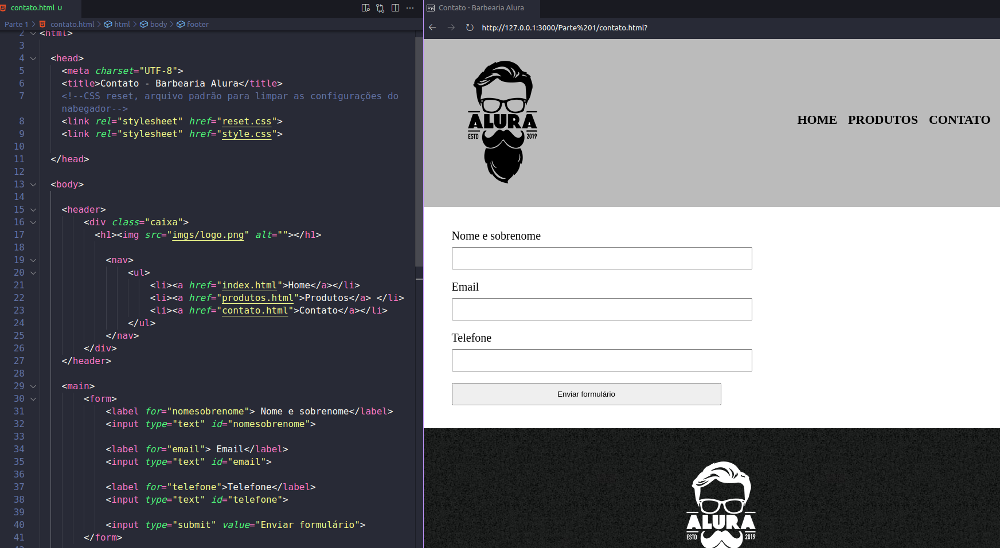

### HTML5 e CSS3 parte 3: tipos de campos diferentes 

02/06/2022 | 03. tipos de campos diferentes 

**O que aprendemos?**

Nesta aula, vimos:

- O textarea, para entradas de texto de mais de uma linha

- O input do tipo radio

- Como agrupar vários input do tipo radio, impedindo que mais de um input seja selecionado

- O input do tipo checkbox

- Que podemos criar um input dentro de um label, assim associando-os

- Mais estilizações para a nossa página

- Como funciona a hierarquia no CSS

- O select, que é seletor, um campo de seleção de um item, e o option, que representa cada opção do seletor

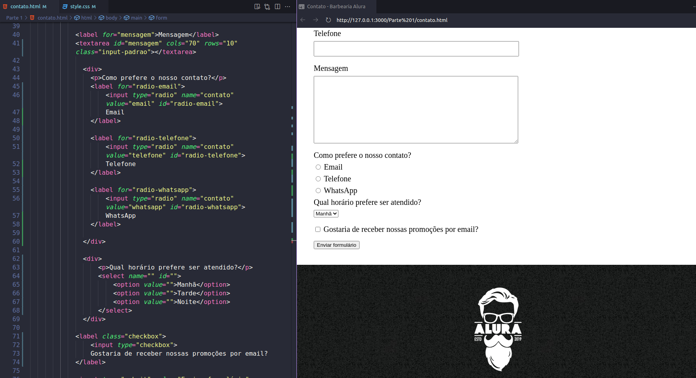

### HTML5 e CSS3 parte 3: melhorando a semântica  

02/06/2022 | 04. Melhorando a semântica 

**O que aprendemos?** 

- Alguns tipos de inputs para celular: email, tel, number, password, date, datetime, month e search

- Como não permitir que um campo não seja preenchido, através do atributo required

- Como exibir uma sugestão de preenchimento para os campos, através do atributo placeholder

- Como deixar uma opção marcada por padrão nos nossos input radio e checkbox, através do atributo checked

- Como estruturar melhor o nosso código com fieldset e legend

- Como adicionar uma alternativa à imagem, descrevendo-a, com o atributo alt

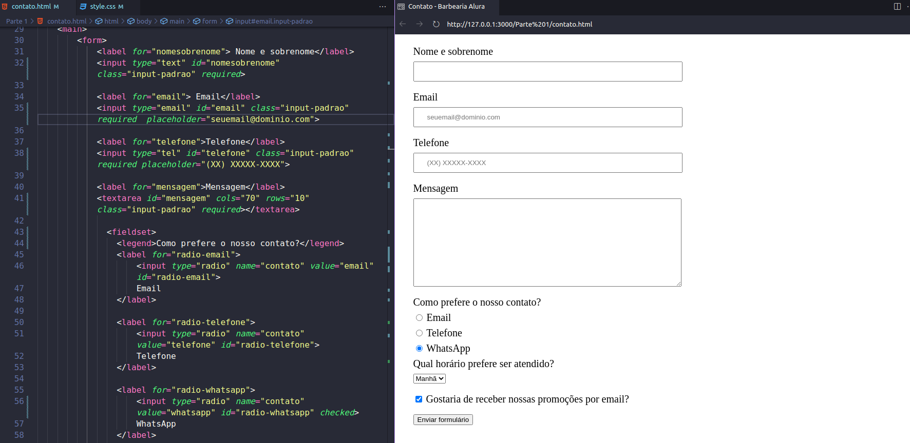

### HTML5 e CSS3 parte 3: CSS avançado

02/06/2022 | 05. CSS avançado

**O que aprendemos?**

- Como estilizar o botão de envio de formulário

- A realizar transições nos nossos elementos, com a propriedade CSS transition

- A modificar o estilo do ponteiro do mouse, quando passar por cima de determinado elemento, através da propriedade CSS cursor

- A realizar transformações nos nossos elementos, como aumentar proporcionalmente a escala de determinado elemento ou rotacioná-lo, através da propriedade CSS transform

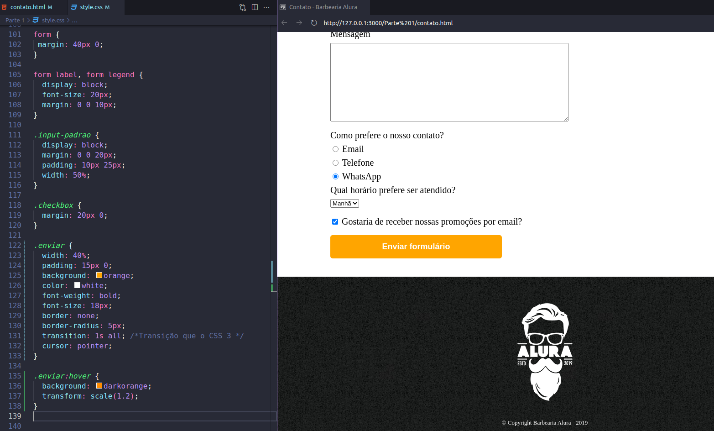

### HTML5 e CSS3 parte 3: Estrutura de tabelas

02/06/2022 | 06. Estrutura de tabelas

**O que aprendemos?**

- A criar uma tabela HTML

- A tag table, que representa a tabela

- A tag tr, que representa a linha da tabela

- A tag td, que representa a célula da tabela

- A tag thead, que representa o cabeçalho da tabela

- A tag tbody, que representa o corpo da tabela

- A tag th, que representa a célula do cabeçalho da tabela

- A tag tfoot, que representa o rodapé da tabela

- A estilizar a tabela

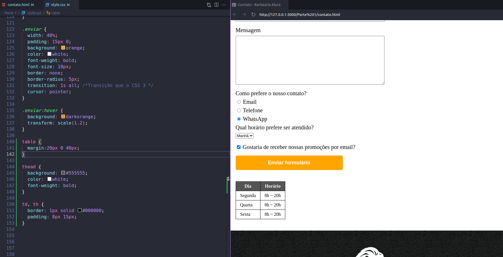

### Criei o menu de navegação na HOME igual ao das outras páginas e foi inserido um footer

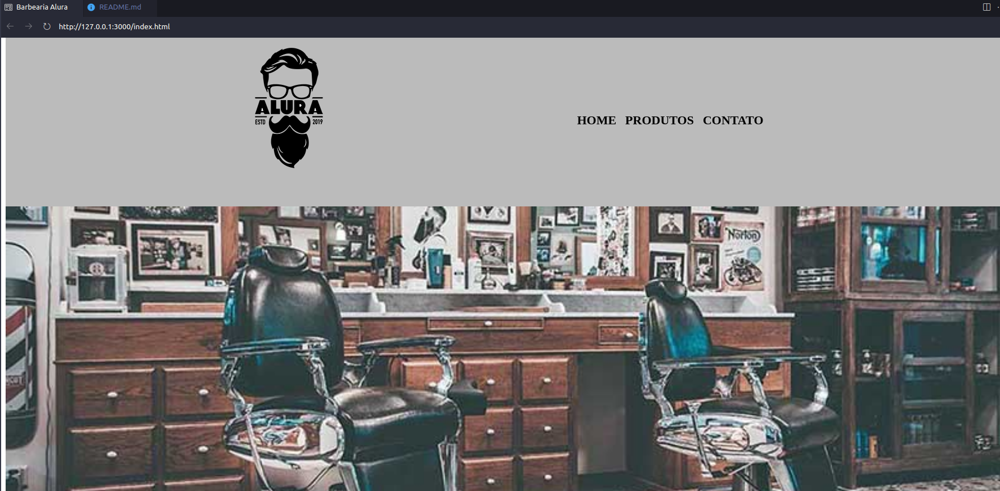

### HTML5 e CSS3 parte 4: avançando no CSS

03/06/2022 e 05/06/2022 | 01. Adaptando a página inicial

**O que aprendemos?**

- A ajustar a página principal para utilizar os mesmos padrões da página de produtos

- Medidas proporcionais com CSS

- Como funciona a flutuação dos elementos e como modificá-la, com a 
propriedade float do CSS

- Como limpar o float, com a propriedade clear do CSS

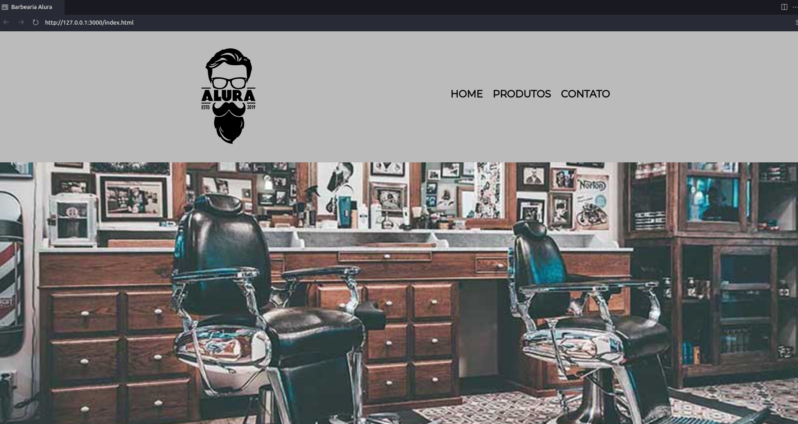

05/06/2022 | 02. Conteúdo externo

**O que aprendemos?**

- A utilizar fontes externas nas nossas páginas

- Como incorporar um mapa à nossa página

- Como incorporar um vídeo à nossa página

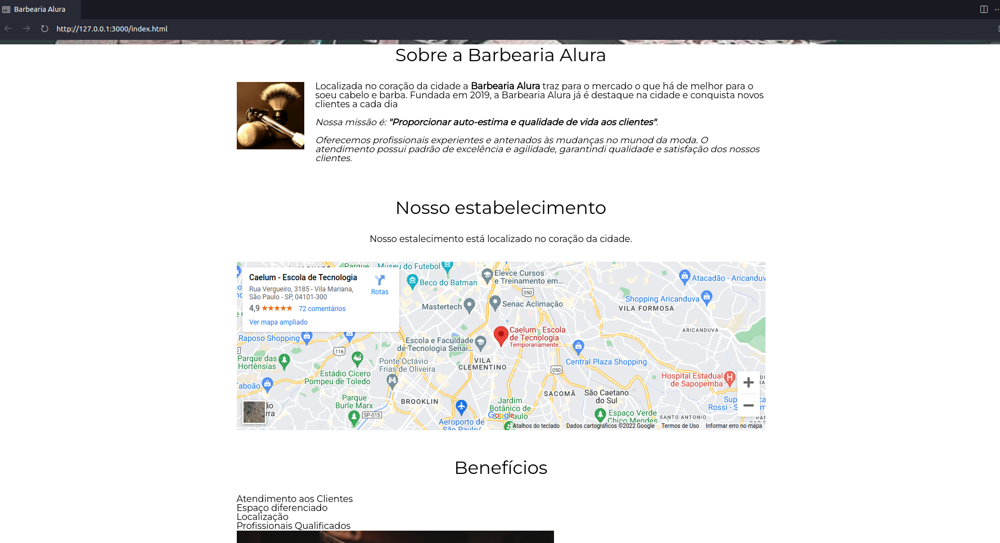
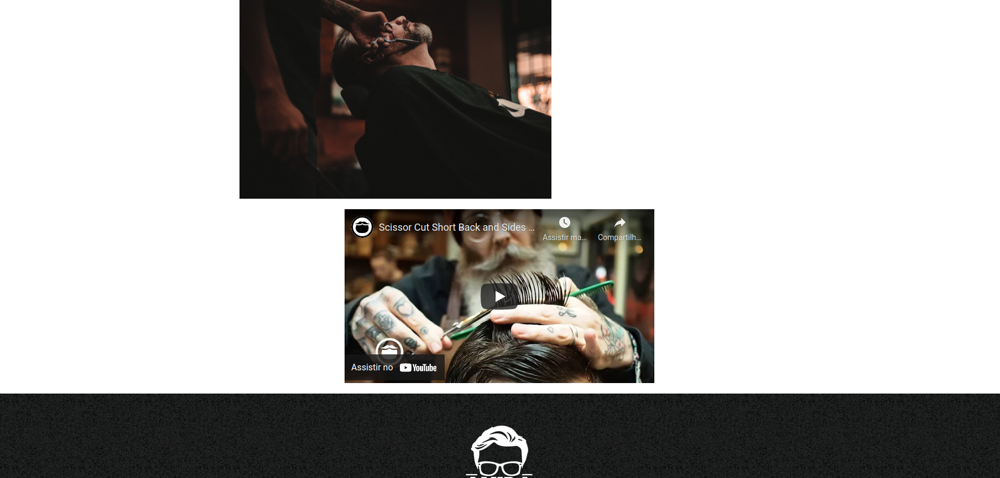

06/06/2022 | 03. Melhorando o CSS

**O que aprendemos?**

- A melhorar mais ainda a semântica da página principal, com novas divisões, classes, etc

- Novas pseudo-classes

- Como aplicar um background gradiente na página

- Pseudo-elementos

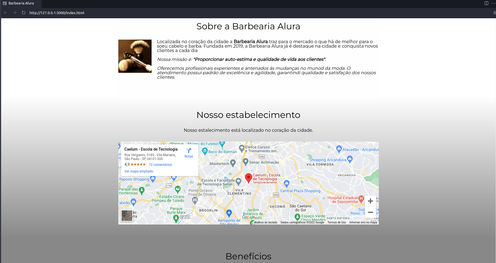
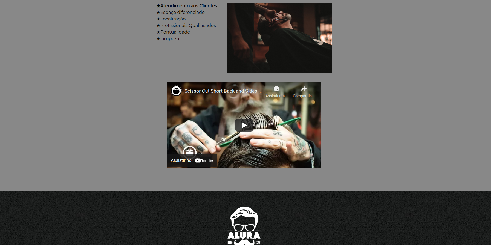

07/06/2022 | 04. Selecionando qualquer coisa 

**O que aprendemos?**

Seletores avançados CSS

 - main > p { }

 - img + p { }

 - img ~ p { }

 - main p:not(#missao) { }

05. Opacidade e sombra

**O que aprendemos?**

- Como manipular a opacidade dos elementos, com a propriedade CSS **opacity**

- Como manipular a opacidade das cores

- Como adicionar um sombreamento em volta dos elementos, com a propriedade CSS **box-shadow**

- Como adicionar um sombreamento em textos, com a propriedade CSS **text-shadow**

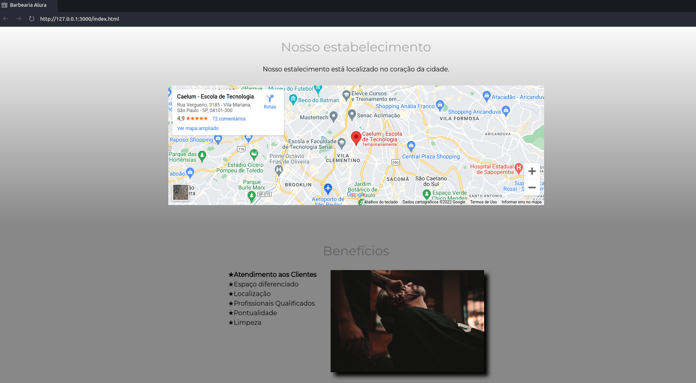